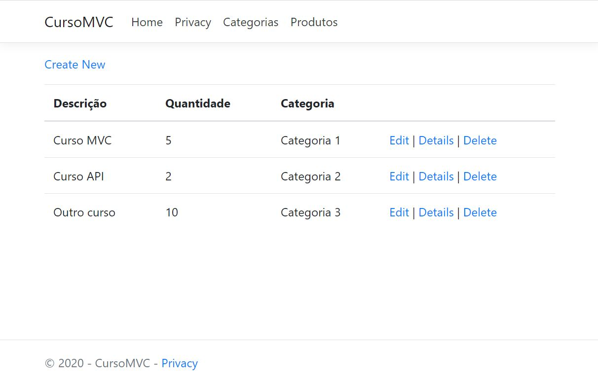
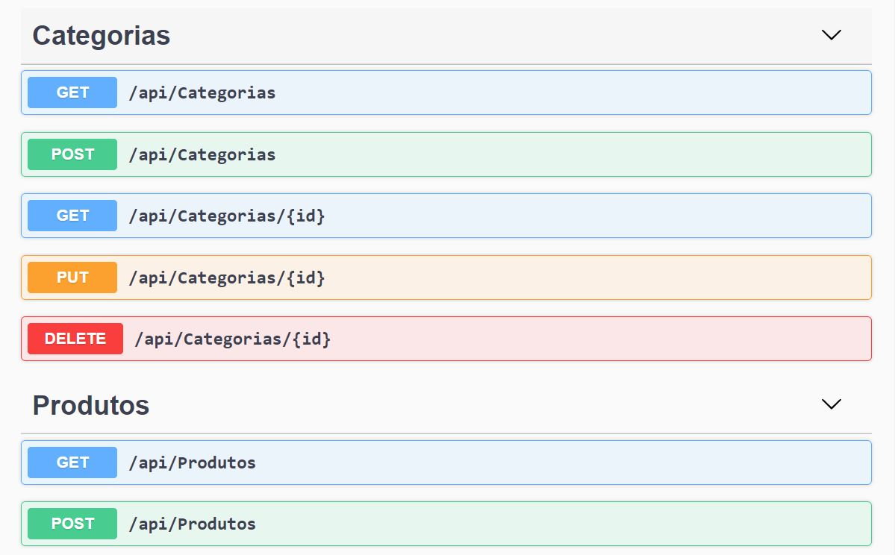

# Simples projeto .NET MVC utilizando Migrations e Swagger

Projeto criado a partir da aula "Desenvolvimento de aplicações com .NET", do bootcamp da Digital Innovation One - Decola Dev Avanade 2021.

Tutor: Anderson Clavico Moreira.

&nbsp;

&nbsp;

