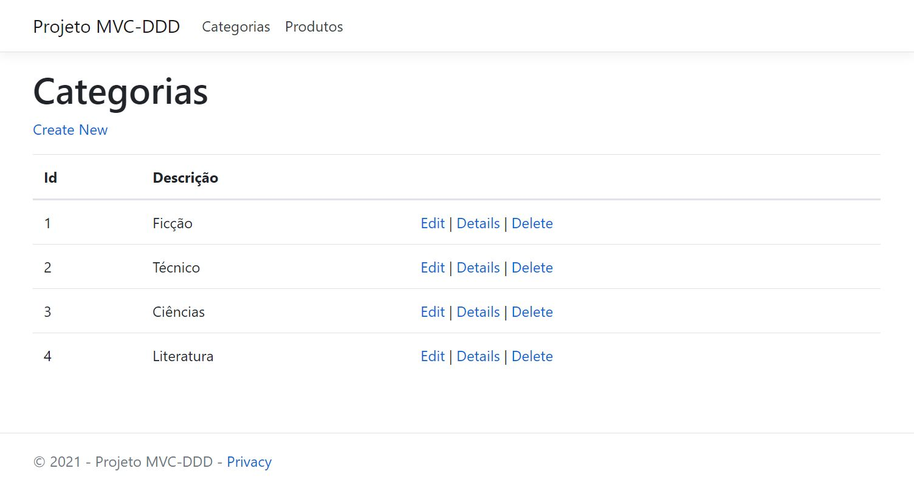
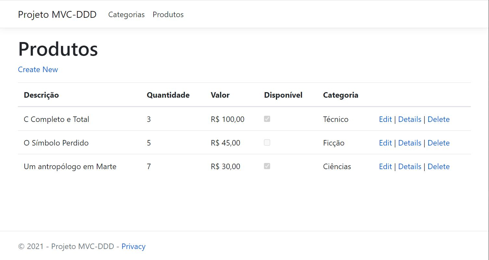

# Simples projeto .NET MVC utilizando DDD
Adaptação do projeto criado na aula "Desenvolvimento de aplicações com .NET", do tutor Anderson Clavico Moreira, 
aos conceitos de Domain Driven Development, explicados na aula "Desenvolvendo sua aplicação com C# usando DDD", de Alexandre Daccas, 
ambas as aulas da [Digital Innovation One](https://web.digitalinnovation.one/home).

A implementação foi feita tendo como referência o [Aurora Api Project](https://github.com/alexalvess/aurora-api-project) 
e seguindo os passos de criação demonstrados no "[Tutorial ASP.NET MVC 5 + DDD + EF + AutoMapper + IoC + Dicas e Truques](https://youtu.be/i9Il79a2uBU)", de [Eduardo Pires](https://www.eduardopires.net.br/).

## Sobre
O projeto é um simples CRUD de Categorias e Produtos.

&nbsp;

 

&nbsp;

&nbsp;

## Utilização
1. Configurar a string de conexão com o banco de dados no arquivo appsettings.json, alterando o valor de "DefaultConnection".
2. Adicionar as tabelas utilizando Migrations:
   1. Abrir o Package Manager Console
   2. Alterar o projeto default para CursoMVC-DDD.Infra.Data
   3. Executar o comando: Add-Migration [NOME DA MIGRATION]
   4. Executar o comando: Update-Database
